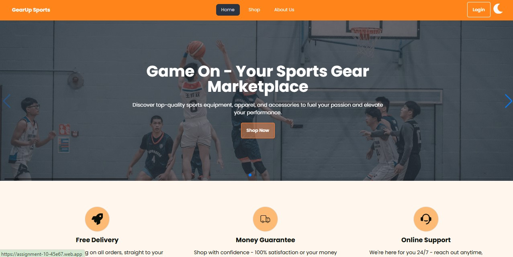

<h1>GearUp Sports</h1>

<div >
  
</div>

###
## Project Overview

GearUp Sports is a responsive sports equipment e-commerce platform that allows customers to browse, purchase, and review various sports accessories, including gear, apparel, and more. The website supports user authentication, product management, and offers an intuitive shopping experience.

## Live Website URL

[Visit GearUp Sports](https://assignment-10-45e67.web.app) 

## Key Features

- **Responsive Design**: Optimized for all devices, including mobile, tablet, and desktop.
- **User Authentication**: Supports registration and login using email and third-party services like Google.
- **Product Management**: Users can add, update, and view equipment details.
- **Sort Functionality**: Allows users to sort sports equipment by price in ascending.
- **Dark/Light Theme Toggle**: A seamless theme switcher for an enhanced user experience.
- **Private Routes**: Protected pages like Add Equipment, My Equipment List, View Details, and Update Page.
- **Error-Free Navigation**: Ensures that users can reload the page from any route without errors.
- **404 Page**: A custom 404 page for non-existing routes.

## Technologies Used

- **Frontend**: React.js, TailwindCSS,DaysiUi, React Router, Firebase Authentication
- **Backend**: Node.js, Express.js, MongoDB
- **Authentication**: Firebase Authentication
- **State Management**: React Context API
- **Packages**:
  - `react-icons`: For scalable vector icons
  - `swiper`: For image sliders
  - `lottie-react`: For animations
  - `react-tooltip`: For tooltips

## Setup and Installation

### Clone the Repository

### Install Dependencies

```bash
npm install
```
### Install Dependencies

```bash
npm run dev
```
Open your browser and navigate to http://localhost:3000.